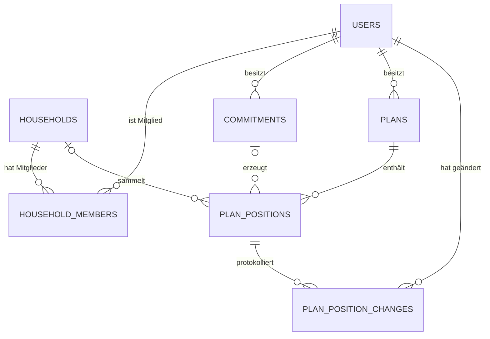

# Datenmodell

Spiegelt den **gebauten Stand** in `backend/app/models/`.
Für Konzept und Entstehungsgeschichte siehe [../gekritzel/](../gekritzel/).

Stand: 2026-07-28 · Commit `2c5e884`

## Zusammenhänge

## Die drei Regeln, aus denen alles folgt

**1 · Der Haushalt besitzt nichts.**
Keine Konten, keine Verträge, keine Posten. Er ist eine reine Planungsebene
und sagt nur, wer zusammen plant.

**2 · Alles gehört genau einer Person.**
Verträge, Pläne, Posten — jedes hat einen Eigentümer. Auch der
WG-Internetvertrag läuft auf den, der ihn unterschrieben hat.

**3 · Der Haushaltsplan ist keine Tabelle.**
Er ist die Zusammenstellung aller Posten aller Mitglieder, bei denen
`household_id` gesetzt ist. Jeder Posten existiert **einmal** — es gibt
nichts zu synchronisieren und nichts, das auseinanderlaufen kann.

## Tabellen

| Tabelle | Klasse | Datei | Doku |
|---|---|---|---|
| `users` | `User` | `models/user.py` | [user.md](user.md) |
| `households` | `Household` | `models/household.py` | [household.md](household.md) |
| `household_members` | `HouseholdMember` | `models/household.py` | [household.md](household.md) |
| `commitments` | `Commitment` | `models/commitment.py` | [commitment.md](commitment.md) |
| `plans` | `Plan` | `models/plan.py` | [plan.md](plan.md) |
| `plan_positions` | `PlanPosition` | `models/plan.py` | [plan.md](plan.md) |
| `plan_position_changes` | `PlanPositionChange` | `models/plan.py` | [plan.md](plan.md) |

Dazu: [enums.md](enums.md) — Kategorien, Blöcke, Rhythmen und die
Block-Ableitung. [rechte.md](rechte.md) — wer darf was.

## Konventionen

**Tabellenname = Klassenname in snake_case, Plural.** Ohne Ausnahme. Deshalb
`PlanPosition` → `plan_positions`, nicht `positions`.

**Eine Datei pro Aggregat.** `household.py` enthält `Household` und
`HouseholdMember`, `plan.py` enthält `Plan`, `PlanPosition` und
`PlanPositionChange`. Kind bei Elternteil.

**Beträge immer `Numeric(12, 2)`**, nie `Float`. Bei Geld führt Fließkomma zu
Rundungsfehlern, die erst nach Monaten auffallen.

**Enums als VARCHAR** (`native_enum=False`), ohne Check-Constraint —
SQLAlchemy 2.0 setzt `create_constraint` standardmäßig auf `False`. Ein neuer
Enum-Wert braucht damit **keine Migration**, wird aber auch nur in Python
geprüft. Details in [enums.md](enums.md).

**Abgeleitete Werte werden gespeichert, nicht berechnet.** `position.block`
kommt beim Anlegen aus `resolve_block()` und bleibt dann stehen. Sonst würde
eine spätere Regeländerung rückwirkend alte Pläne umschreiben.

**Der Nutzer entscheidet, wo es keine Wahrheit gibt.** Ob Sprit Bedarf oder
Wunsch ist, hängt vom Haushalt ab. Nur was rechnerisch feststeht — Tilgung und
Sparen sind gebundenes Geld — ist im Code festgelegt.

## Fallstricke

> **Alembic erkennt Check-Constraints nicht.**
> `alembic revision --autogenerate` vergleicht sie grundsätzlich nicht. Änderst
> du einen Constraint am Modell, entsteht eine **leere** Migration und es sieht
> aus, als hätte es geklappt. Immer von Hand mit `op.create_check_constraint`
> nachtragen.

> **Alembic + fastapi-users.**
> Autogenerate erzeugt `fastapi_users_db_sqlalchemy.generics.GUID`, importiert
> das aber nicht. Der Import steht deshalb fest in `alembic/script.py.mako`.
