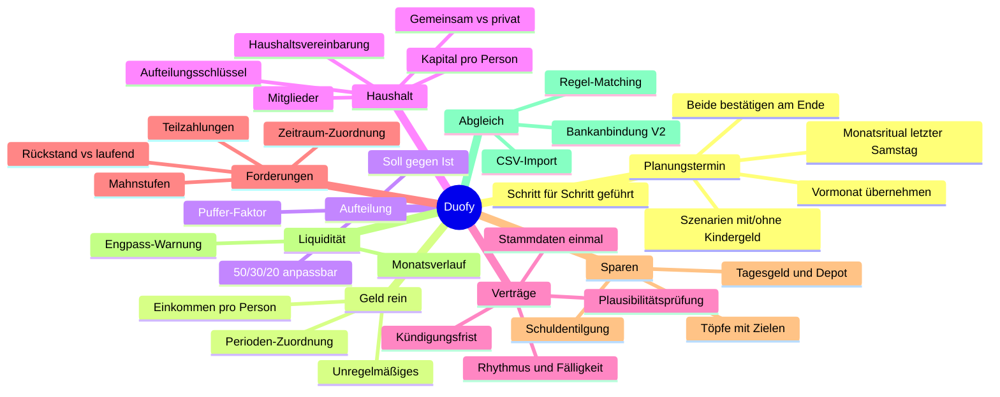

# Feature-Mindmap

Stand: 28.07.2026 — Ideensammlung, noch keine Priorisierung.

---

## 1 · Der Planungstermin

Der zentrale Bildschirm. Bildet das ab, was heute am Samstag passiert.

- Geführter Ablauf: Einnahmen → Fix → Wünsche → Investitionen → Sparen → Puffer
- **Vormonat übernehmen** als Startpunkt — nicht bei null anfangen
- **Beide bestätigen** — der Plan gilt erst, wenn beide zugestimmt haben
- **Szenarien:** „mit Kindergeld" / „ohne Kindergeld und KiZ" nebeneinander
- Ergebnis: ein festgeschriebener Monatsplan

## 2 · Geld rein

- Einkommen pro Person: Lohn, Wohngeld, Pflegegeld, Kindergeld …
- Unregelmäßiges: Bonus, Steuerrückzahlung, Nebenkostenrückzahlung
- **Perioden-Zuordnung:** Geld, das am 30.07. kommt, gehört zum August-Plan

## 3 · Die Aufteilung

- 50/30/20 als Startwert, frei anpassbar
- **Puffer-Faktor:** nur X % des Einkommens werden verplant, der Rest bleibt
  bewusst frei. 50/30/20 rechnet sich auf den verplanten Teil
- Soll gegen Ist pro Topf, live beim Planen sichtbar

## 4 · Haushalt

Das Alleinstellungsmerkmal.

- Mitglieder (2–6 Personen, Paar oder WG)
- Positionen sind **gemeinsam** oder **privat**
- Aufteilungsschlüssel: 50/50 · nach Einkommen · feste Beträge
- **Kapital pro Person:** wem gehört was, wer hat wieviel eingebracht,
  ist die Aufteilung gerecht — als Auswertung, nicht als Handarbeit
- **Haushaltsvereinbarung:** Regeln, die beide setzen und die beim Planen
  greifen. Z. B. „Anschaffungen über 100 € brauchen beide",
  „Puffer nie unter 300 €"

## 5 · Verträge

- Einmal anlegen: Anbieter, Betrag, Rhythmus, Fälligkeitstag, Konto, Person
- Erzeugt seine Kosten danach selbst — auch quartalsweise und jährliche
- Laufzeit, Kündigungsfrist, Erinnerung vor Ablauf
- **Plausibilitätsprüfung:** abgebuchter Betrag weicht vom Vertrag ab → nachfragen

## 6 · Forderungen

Aus dem GEZ-Fall entstanden.

- Gläubiger, Aktenzeichen, **Zeitraum**, Ursprungsbetrag
- Status über Mahnstufen: offen → Mahnung 1 → Mahnung 2 → Inkasso → erledigt
- Teilzahlungen und Raten dagegenrechnen
- **Trennung laufend / Rückstand** in der Monatsansicht
- Sichtbar machen, wann ein Rückstand durch ist und Geld frei wird

## 7 · Sparen

- Töpfe: Auto, Urlaub, Gerichtskosten, Zähne … mit Ziel und Zieldatum
- Zuordnung: welcher gesparte Euro gehört in welchen Topf
- Konten: Tagesgeld, Depot
- Schuldentilgung läuft im selben Block

## 8 · Liquidität

- Monatsverlauf entlang der Fälligkeitstage
- „Ab dem 14. wird's knapp, am 28. kommt Kindergeld"
- Warnung, wenn eine Fälligkeit nicht gedeckt ist

## 9 · Abgleich statt Tracking

Kein Kategorisieren. Die geplanten Positionen existieren bereits — es geht nur
um **Zuordnung** von Buchung zu Position.

- MVP: CSV-Import aus der Bank
- Regel-Matching: „Lastschrift O2, 34,99 € → Position *Internet O2*"
- Nur die Reste landen beim Nutzer
- V2: Bankanbindung über GoCardless (PSD2)

---

## Bewusst nicht drin

- Automatische Kategorisierung von Ausgaben („KI rät die Kategorie")
- Vermögensverwaltung, Anlageberatung
- Zahlungen auslösen — Duofy bewegt kein Geld
