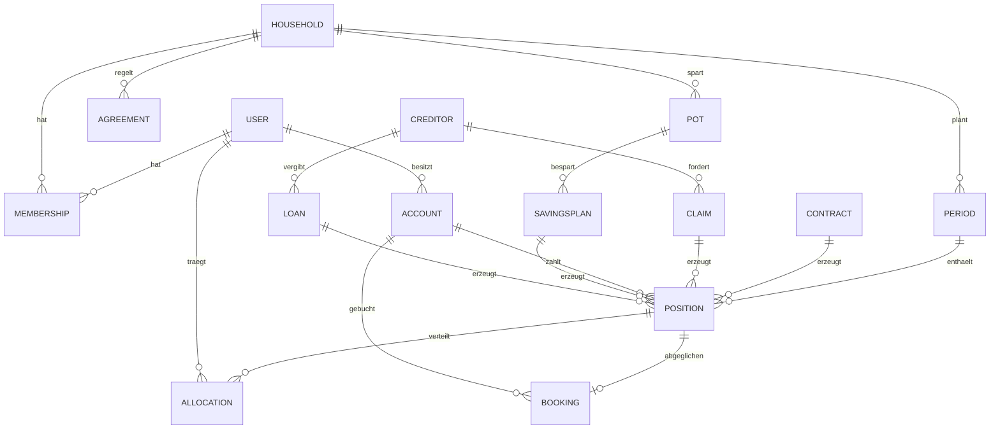

# Domainmodell

Erster Entwurf. Noch nicht in Code gegossen — Diskussionsgrundlage.



---

## Kern

### User
Eine Person. Hat einen eigenen Account, auch ohne Haushalt.

### Household
Die **Planungsebene**. Existiert nur in Duofy, nicht bei einer Bank.
Ein User kann in mehreren Haushalten sein.

### Membership
Verbindet User und Haushalt. Enthält die Rolle und den Anteil am
Aufteilungsschlüssel.

### Agreement
Die **Haushaltsvereinbarung** — Regeln, die beide gesetzt haben und die beim
Planen greifen.

```
typ         betrags_schwelle | mindest_puffer | freigabe_pflicht
wert        100,00 €
gilt_ab     01.08.2026
zugestimmt  beide
```

---

## Geld

### Account
Ein reales Konto. **Gehört immer genau einer Person** — nie einem Haushalt.
Das ist der Punkt, an dem die Insolvenz-Situation sauber abgebildet wird.

```
typ      giro | tagesgeld | depot | bar
inhaber  User
```

Ein „gemeinsames Konto" ist in Duofy kein Konto, sondern eine
Aufteilungsregel auf Positionen.

### Booking
Eine tatsächliche Buchung, aus CSV-Import oder später aus der Bankanbindung.
Wird gegen eine Position gematcht. Rohdaten, wird nie geändert.

---

## Planung

### Period
Ein Planungsmonat. **Nicht identisch mit dem Kalendermonat** — läuft vom
Planungstermin bis zum nächsten.

```
start / ende         explizit, nicht aus dem Kalender abgeleitet
status               entwurf | bestaetigt | abgeschlossen
bestaetigt_von       Liste der User
verplanungs_faktor   z.B. 0.90 → 10 % bleiben bewusst Puffer
quote_bedarf         0.50
quote_wuensche       0.30
quote_sparen         0.20
szenario             mit_kindergeld | ohne_kindergeld
```

### Position
Die zentrale Einheit. Ein geplanter Betrag in einer Periode.

```
periode          Period
bezeichnung      "Internet O2"
betrag_geplant   DECIMAL
betrag_ist       DECIMAL, nullable
block            einnahme | bedarf | wunsch | investition | sparen | tilgung
kategorie        Category — wofür ist das Geld (sachlich)
faellig_am       Tag im Monat
zahlungsart      abhebung | ueberweisung | dauerauftrag | lastschrift | besonderheit
konto            Account — von wo geht/kommt es
quelle           manuell | vertrag | forderung
sichtbarkeit     gemeinsam | privat
```

> **Wichtig:** `faellig_am` (wann fließt das Geld) und `periode` (zu welchem
> Plan es gehört) sind bewusst getrennt. Das löst das Finanzblick-Problem:
> Lohn am 30.07. gehört zur August-Periode.

### Category
Wofür das Geld sachlich ist. **Systemweit vorgegeben**, nicht pro Haushalt frei
erfindbar — sonst driften Haushalte auseinander und Auswertungen sind wertlos.

```
name           "Mobilität"
default_block  bedarf | wunsch | sparen
locked         bool — darf der Block überhaupt abweichen?
```

Seed nach der 50/30/20-Regel:

| Kategorie | default_block | locked |
|---|---|---|
| Wohnen | bedarf | ja |
| Versicherung | bedarf | ja |
| Lebensmittel | bedarf | ja |
| Gesundheit | bedarf | ja |
| Mobilität | bedarf | **nein** |
| Kommunikation | bedarf | **nein** |
| Kinder | bedarf | nein |
| Abos & Streaming | wunsch | ja |
| Freizeit | wunsch | ja |
| Urlaub | wunsch | ja |
| Taschengeld | wunsch | ja |
| Rücklagen | sparen | ja |
| Tilgung | sparen | ja |
| Investition | investition | ja |

### HouseholdCategoryRule
Die Abweichung, auf die sich der Haushalt **einmal** einigt. Verhindert, dass
zwei Personen dieselbe Sache unterschiedlich einsortieren.

```
haushalt    Household
kategorie   Category
block       überschreibt Category.default_block
begruendung Text, optional
```

Nur erlaubt, wenn `Category.locked = false`.

### Auflösung des Blocks

```
Systemvorgabe  Category.default_block
      ↓  überschreibbar wenn nicht locked
Haushaltsregel HouseholdCategoryRule.block
      ↓  überschreibbar im Einzelfall, mit Begründung
Position       Position.block  ← wird GESPEICHERT
```

> **Wichtig:** Der aufgelöste Block wird beim Anlegen der Position
> **eingefroren**, nicht bei jedem Lesen neu berechnet.
>
> Sonst ändert eine neue Haushaltsregel rückwirkend alle abgeschlossenen
> Monatspläne. Ein bestätigter Plan muss zeigen, was damals entschieden wurde.

### Allocation
Wem wird eine Position anteilig zugerechnet. Hieraus fällt die
Kapitalaufteilung heraus.

```
position   Position
user       User
anteil     DECIMAL  (Betrag oder Prozent)
```

---

## Stammdaten

### Contract
Ein laufender Vertrag. Wird **einmal** angelegt und erzeugt danach seine
Positionen selbst.

```
anbieter          "O2"
betrag            34,99 €
rhythmus          monatlich | quartal | halbjahr | jaehrlich
faellig_am        Tag / Monate
konto             Account
person            User
laufzeit_bis      Datum, nullable
kuendigungsfrist  Tage, nullable
aktiv             bool
```

Deckt die Fälle aus der Jahresübersicht ab: GEZ quartalsweise, AVD jährlich
im September, Kreditkartengebühr jährlich im Dezember.

### Claim
Eine offene Forderung mit **Lebenslauf**. Aus dem GEZ-Fall entstanden.

```
glaeubiger        "Beitragsservice"
aktenzeichen      String, nullable
zeitraum_von/bis  ← das Entscheidende: wofür ist die Forderung
ursprungsbetrag   DECIMAL
gebuehren         DECIMAL
status            offen | mahnung_1 | mahnung_2 | inkasso | tituliert | erledigt
vertrag           Contract, nullable
```

Zahlungen laufen als Positionen dagegen. Restbetrag = Ursprung + Gebühren −
Zahlungen.

Damit wird in der Monatsansicht sichtbar: *„GEZ 55,08 € = laufend 18,36 +
Rückstand 2024 36,72"* — und wann der Rückstand durch ist.

### Creditor
Ein Gläubiger. Eigene Stammdaten, weil an einem Gläubiger mehrere Forderungen
*und* Kredite hängen können.

```
name           "Beitragsservice", "Sparkasse"
kontakt        Anschrift, Ansprechpartner
insolvenz_rel  bool — für das laufende Verfahren relevant
```

### Loan
Ein Kredit. Läuft fachlich im Block **Sparen (20 %)** — Tilgung ist gebundenes
Geld, kein Verbrauch.

```
glaeubiger     Creditor
urspruengl.    DECIMAL
restschuld     DECIMAL
rate           DECIMAL
zinssatz       DECIMAL, nullable
laufzeit_bis   Datum, nullable
konto          Account
```

### PrivateLoan
Geliehenes Geld zwischen Privatpersonen — **in beide Richtungen**. Bewusst
eine Entität mit Richtungsfeld, nicht zwei getrennte Verwaltungen.

```
person         Name / Kontakt (kein User-Account nötig)
richtung       ich_schulde | mir_wird_geschuldet
betrag         DECIMAL
offen          DECIMAL — berechnet aus den Zahlungen
anlass         "Umzugswagen", "Urlaub vorgestreckt"
datum          Datum der Leihe
rueckzahlung   offen | in_raten | erledigt
faellig_bis    Datum, nullable
notiz          Text
```

**Wichtig für die Quoten:** Verleihen und Zurückbekommen laufen **am
50/30/20 vorbei** — es ist eine Umschichtung, keine Einnahme oder Ausgabe.
Sonst wird dasselbe Geld zweimal verplant.

Nur **Tilgungsraten** an eine Privatperson zählen, und zwar im Block
**Sparen (20 %)** — wie jeder andere Kredit auch.

> **Offen zu klären:** Forderungen gegen Dritte gehören zum Vermögen und
> können im laufenden Insolvenzverfahren relevant sein. Vor der Umsetzung mit
> dem Insolvenzberater abklären. Keine Rechtsberatung durch dieses Dokument.

### SavingsPlan
Ein regelmäßiger Sparbetrag auf einen Topf. Erzeugt Positionen wie ein Vertrag.

```
topf        Pot
betrag      DECIMAL
rhythmus    monatlich | quartal | jaehrlich
konto       Account
aktiv       bool
```

### Pot
Ein Spartopf mit Ziel.

```
name        "Auto", "Urlaub", "Zähne Jasmin"
zielbetrag  DECIMAL, nullable
zieldatum   Datum, nullable
konto       Account (Tagesgeld / Depot)
stand       aus den Positionen berechnet, nicht gespeichert
```

---

## Quellen einer Position

`Position.quelle` bestimmt, wer die Position erzeugt hat:

| quelle | erzeugt von | ab |
|---|---|---|
| `manuell` | Nutzer, einmalig oder wiederkehrend | MVP |
| `vertrag` | Contract | V1.1 |
| `sparplan` | SavingsPlan | V1.2 |
| `kredit` | Loan | V1.3 |
| `forderung` | Claim | V1.3 |
| `privatdarlehen` | PrivateLoan — nur Tilgungsraten | V1.3 |

Dadurch bleibt die Monatsplanung stabil, während Verwaltungen dazukommen.
Siehe [06-mvp.md](06-mvp.md).

---

## Regeln

- Beträge **immer** `DECIMAL`/`NUMERIC` — nie Float
- `Account` gehört einer Person, niemals einem Haushalt
- `Period.start`/`ende` explizit setzen, nie aus dem Kalender ableiten
- `Booking` ist unveränderlich — Korrekturen laufen über die Zuordnung
- Topf-Stände und Ist-Prozente werden **berechnet**, nicht gespeichert

## Offen

Siehe [05-offene-fragen.md](05-offene-fragen.md).
